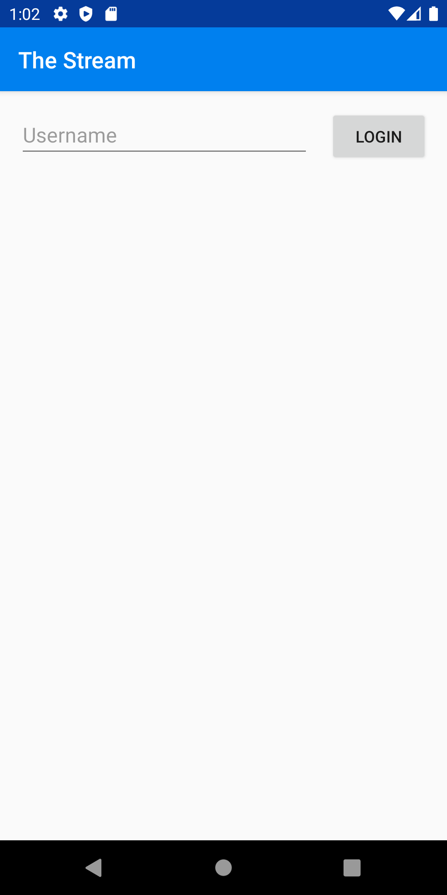

# Building a Custom Chat Application with Android – Direct Messaging and Group Chat

In this series, we'll create a simple Android application that allows a user to chat 1-on-1 and chat in groups. Stream's [Chat API](https://getstream.io/chat/), combined with Android, make it straightforward to build this sort of complex interaction. All source code for this application is available on [GitHub](https://github.com/psylinse/the-stream-android/). This application is fully functional on Android.

To keep things focused, we'll be showing only the essential code. Often there is the context around those code snippets, which are necessary, such as layout or navigation. Please refer to the full source code if you're confused on how something works. Each snippet is accompanied by a comment explaining which files and lines it came from. Also, please refer to the `build.gradle` file to see what libraries we're using.

To [build our social network](https://getstream.io/build/social-networks/), we'll need both a backend and a mobile application. Most of the work is done in the mobile app, but we need the backend to create frontend tokens for interacting with the Stream API securely.

The backend relies on [Express](https://expressjs.com/) (Node.js) leveraging Stream's [JavaScript library](https://github.com/GetStream/stream-js).

The mobile application is built in Kotlin wrapping Stream's [Android library](https://github.com/GetStream/stream-chat-android). The basic flow of the application is as follows.

The app goes through these steps to allow a user to chat with another:

* User navigates to the user list and clicks on their name or chat icon. The mobile application joins a 1-on-1 chat channel between the two users.
* The app queries the channel for previous messages and indicates to Stream that we'd like to watch this channel for new messages. The mobile app listens for new messages.
* The user creates a new message and sends it to the Stream API.
* When the message is created, or a message from the other user is received, the mobile application consumes the event and displays the message.

Since we're relying on the Stream mobile libraries to do the heavy lifting, most of this work happens in the Stream Chat UI Components. The code is split between the Android mobile application contained in the `android` directory, and the Express backend is in the `backend` directory. See the README.md in the `backend` folder to see installing and running instructions. If you'd like to follow along with running code, make sure you get both the backend and mobile app running before continuing.

## Prerequisites

Basic knowledge of [Node.js](https://nodejs.org/en/) (JavaScript), Kotlin, and Android is required to follow this tutorial. This code intended to run locally.

If you'd like to follow along, you'll need an account with [Stream](https://getstream.io/accounts/signup/). You must have the latest Android Studio installed with a relatively recent Android SDK version. If you're having a hard time, feel free to open a [GitHub issue](https://github.com/psylinse/the-stream-android/issues).

You also need to have the backend running. Please follow the instructions in the `backend` `README.md`.

Let's get started!

## Configuring Stream Chat

First, we need to log in and initialize Stream.

### Step 1: Log in

To communicate with Stream, we need a secure frontend token. This allows our mobile application to communicate with Stream's API directly. To do this, we'll need a `backend` endpoint that uses our Stream account secrets to generate this token. Once we have this token, we don't need the backend to do anything else, since the mobile app has access to the full Stream API, scoped to the authenticated user.

First, we'll be building the login screen which looks like this:

To start, let's lay our form out in Android. In our activity_main.xml layout we have a simple ConstraintLayout with an EditText and Button:

