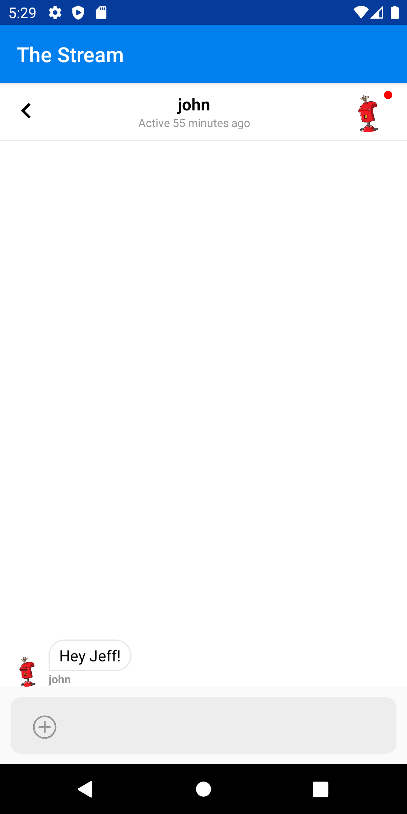
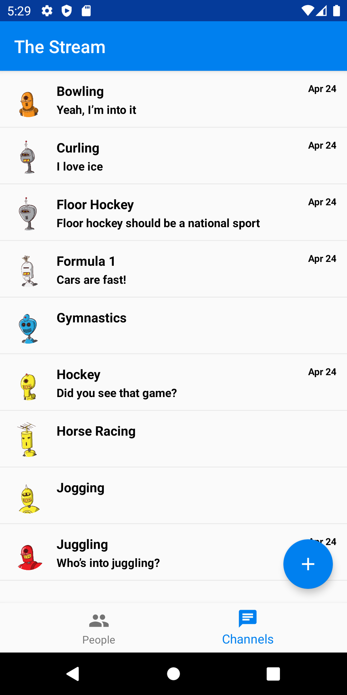

# Building a Custom Chat Application with Android – Direct Messaging and Group Chat

In this post, we'll create a Android application that allows a user to chat 1-on-1 and chat in groups. Stream's [Chat API](https://getstream.io/chat/), combined with Android, make it straightforward to build this sort of complex interaction. All source code for this application is available on [GitHub](https://github.com/psylinse/the-stream-android/). This application is fully functional on Android.

To keep things focused, we'll be showing only the essential code. Often there is the context around those code snippets, which are necessary, such as layout or navigation. Please refer to the full source code if you're confused about how something works. Each snippet is accompanied by a comment explaining which files and lines it came from. Also, please refer to the `build.gradle` file to see what libraries we're using.

To [build our social network](https://getstream.io/build/social-networks/), we'll need both a backend and a mobile application. Most of the work is done in the mobile app, but we need the backend to create frontend tokens for interacting with the Stream API securely.

The backend relies on [Express](https://expressjs.com/) (Node.js) leveraging Stream's [JavaScript library](https://github.com/GetStream/stream-js).

The mobile application is built in Kotlin wrapping Stream's [Android library](https://github.com/GetStream/stream-chat-android). The basic flow of the application is as follows.

The app goes through these steps to allow a user to chat with another:

* User navigates to the user list and clicks on their name or chat icon. The mobile application joins a 1-on-1 chat channel between the two users.
* The app queries the channel for previous messages and indicates to Stream that we'd like to watch this channel for new messages. The mobile app listens for new messages.
* The user creates a new message and sends it to the Stream API.
* When the message is created, or a message from the other user is received, the mobile application consumes the event and displays the message.


Since we're relying on the Stream mobile libraries to do the heavy lifting, most of this work happens in the Stream Chat UI Components. The code is split between the Android mobile application contained in the `android` directory, and the Express backend is in the `backend` directory. See the README.md in the `backend` folder to see installing and running instructions. If you'd like to follow along with running code, make sure you get both the backend and mobile app running before continuing.


## Prerequisites

Basic knowledge of [Node.js](https://nodejs.org/en/) (JavaScript), Kotlin, and Android is required to follow this tutorial. This code intended to run locally.

If you'd like to follow along, you'll need an account with [Stream](https://getstream.io/accounts/signup/). You must have the latest Android Studio installed with a relatively recent Android SDK version. If you're having a hard time, feel free to open a [GitHub issue](https://github.com/psylinse/the-stream-android/issues).

You also need to have the backend running. Please follow the instructions in the `backend` `README.md`.

Let's get started!

## Configuring Stream Chat

First, we need to log in and initialize Stream.

To communicate with Stream, we need a secure frontend token. This allows our mobile application to communicate with Stream's API directly. To do this, we'll need a `backend` endpoint that uses our Stream account secrets to generate this token. Once we have this token, we don't need the backend to do anything else, since the mobile app has access to the full Stream API, scoped to the authenticated user.

First, we'll be building the login screen which looks like this:


To start, let's lay our form out in Android. In our `activity_main.xml` layout we have a simple `ConstraintLayout` with an `EditText` and `Button`:

```xml
<!-- android/app/src/main/res/layout/activity_main.xml:1 -->
<?xml version="1.0" encoding="utf-8"?>
<androidx.constraintlayout.widget.ConstraintLayout xmlns:android="http://schemas.android.com/apk/res/android"
    xmlns:app="http://schemas.android.com/apk/res-auto"
    xmlns:tools="http://schemas.android.com/tools"
    android:layout_width="match_parent"
    android:layout_height="match_parent"
    tools:context="io.getstream.thestream.MainActivity">

    <EditText
        android:id="@+id/user"
        android:layout_width="0dp"
        android:layout_height="wrap_content"
        android:layout_marginStart="16dp"
        android:layout_marginTop="16dp"
        android:autofillHints="Username"
        android:ems="10"
        android:hint="Username"
        android:inputType="textPersonName"
        app:layout_constraintEnd_toStartOf="@+id/submit"
        app:layout_constraintHorizontal_bias="0.5"
        app:layout_constraintStart_toStartOf="parent"
        app:layout_constraintTop_toTopOf="parent"
        tools:ignore="HardcodedText" />

    <Button
        android:id="@+id/submit"
        android:layout_width="wrap_content"
        android:layout_height="wrap_content"
        android:layout_marginStart="16dp"
        android:layout_marginEnd="16dp"
        android:text="Login"
        app:layout_constraintBaseline_toBaselineOf="@+id/user"
        app:layout_constraintEnd_toEndOf="parent"
        app:layout_constraintHorizontal_bias="0.5"
        app:layout_constraintStart_toEndOf="@+id/user"
        tools:ignore="HardcodedText" />

</androidx.constraintlayout.widget.ConstraintLayout>
```

Let's bind to this layout and respond in `MainActivity`:

```kotlin
// android/app/src/main/java/io/getstream/thestream/MainActivity.kt:16
class MainActivity : AppCompatActivity(), CoroutineScope by MainScope() {
    override fun onCreate(savedInstanceState: Bundle?) {
        super.onCreate(savedInstanceState)
        setContentView(R.layout.activity_main)

        val submit: Button = findViewById(R.id.submit)
        val userView: EditText = findViewById(R.id.user)

        submit.setOnClickListener {
            val user: String = userView.text.toString()

            launch(Dispatchers.IO) {
                BackendService.signIn(user)

                val chatCredentials = BackendService.getChatCredentials()

                launch(Dispatchers.Main) {
                    ChatService.init(applicationContext, user, chatCredentials)

                    startActivity(
                        Intent(applicationContext, AuthedMainActivity::class.java)
                    )
                }
            }
        }
    }
}
```
*Note: The asynchronous approach in this tutorial is not necessarily the best or most robust approach. It's simply a straightforward way to show async interactions without cluttering the code too much. Please research and pick the best asynchronous solution for your application.*

Here we bind to our button and user input. We listen to the submit button and sign in to our backend. Since this work is making network calls, we need to do this asynchronously. We use Kotlin coroutines to accomplish this by binding to the `MainScope`. We dispatch our sign-in code which tells our `BackendService` to perform two tasks, sign in to the backend and get the chat frontend credentials. We'll look at how the `BackendService` accomplishes this in a second.

Once we have our token, we initialize our `ChatService` so we can talk to Stream's API (we'll see this in a second as well). When the user is fully authed and we have our credentials, we start a new activity called `AuthedMainActivity` which is the rest of the application.

Before seeing how we start a chat, let's see how we auth and initialize Stream Chat. First we sign in to the backend via `BackendService.signIn`:

```kotlin
// android/app/src/main/java/io/getstream/thestream/services/BackendService.kt:18
fun signIn(user: String) {
    authToken = post(
        "/v1/users",
        mapOf("user" to user)
    )
        .getString("authToken")
    this.user = user
}

// ...

private fun post(path: String, body: Map<String, Any>, authToken: String? = null): JSONObject {
    val request = Request.Builder()
        .url("$apiRoot${path}")
        .post(JSONObject(body).toString().toRequestBody(JSON))

    if (authToken != null) {
        request.addHeader("Authorization", "Bearer $authToken")
    }

    http.newCall(request.build()).execute().use {
        return JSONObject(it.body!!.string())
    }
}
```

We do a simple `POST` http request to our backend endpoint `/v1/users`, which returns a `backend` `authToken` that allows the mobile application to make further requests against the backend. Since this not a real implementation of auth, we'll skip the backend code. Please refer to the source if you're curious. Also, keep in mind, this token *is* not the Stream token. We need to make another call for that.

Once the user is signed in with our `backend` we can get our chat credentials via `BackendService.getChatCredentials()`:

```kotlin
// android/app/src/main/java/io/getstream/thestream/services/BackendService.kt:27
data class StreamCredentials(val token: String, val apiKey: String)

fun getChatCredentials(): StreamCredentials {
    val response = post(
        "/v1/stream-chat-credentials",
        mapOf(),
        authToken
    )

    return StreamCredentials(
        response.getString("token"),
        response.getString("apiKey")
    )
}
```

Similar to before, we `POST` to our backend to get our chat credentials. The one difference being we use our `authToken` to authenticate against our backend. Since this backend endpoint creates a Stream user for us, let's take a look:

```javascript
// backend/src/controllers/v1/stream-feed-credentials/stream-feed-credentials.action.js:1
import dotenv from 'dotenv';
import stream from "getstream";

dotenv.config();

exports.streamFeedCredentials = async (req, res) => {
  try {
    const apiKey = process.env.STREAM_API_KEY;
    const apiSecret = process.env.STREAM_API_SECRET;
    const appId = process.env.STREAM_APP_ID;

    const client = stream.connect(apiKey, apiSecret, appId);

    await client.user(req.user).getOrCreate({ name: req.user });
    const token = client.createUserToken(req.user);

    res.status(200).json({ token, apiKey, appId });
  } catch (error) {
    console.log(error);
    res.status(500).json({ error: error.message });
  }
};
```

We use the [Stream JavaScript library](https://github.com/GetStream/stream-js) to create a user (if they don't exist) and generate a [Stream frontend token](https://getstream.io/blog/integrating-with-stream-backend-frontend-options/). We return this token, alongside some API information, back to the Android app.

In the mobile app, we use the returned credentials to intialize our `ChatService` by calling `ChatService.init` in `MainActivity`. Here's the `init`:

```kotlin
// android/app/src/main/java/io/getstream/thestream/services/ChatService.kt:14
object ChatService {
    private lateinit var client: ChatClient
    private lateinit var user: User

    fun init(context: Context, user: String, credentials: BackendService.StreamCredentials) {
        val chat = Chat
            .Builder(credentials.apiKey, context)
            .logLevel(ChatLogLevel.ALL)
            .build()

        this.user = User(user)

        this.user.extraData["name"] = user
        ChatDomain
            .Builder(context.applicationContext, chat.client, this.user)
            .build()

        this.client = chat.client
        this.client.setUser(this.user, credentials.token)
    }
    // ...
}
```

The `ChatService` is a singleton (by using Kotlin's [object](https://kotlinlang.org/docs/reference/object-declarations.html)) which stores a `ChatClient` instance. `ChatClient` is a class provided by Stream's library. This class is specifically used to provide the functionality to client applications via frontend tokens. After we initialize our chat instance, we configure our `ChatDomain` by setting the user that's authenticated. We then set the user on the `ChatClient` and we're good to go.

Now that we're authenticated with Stream, we're ready to start our first chat!

## Creating a 1-on-1 Chat

First, we need to select a user to chat with. We'll build a simple list of users with a prompt to start a chat. Our home screen will look like this:


Let's lay out a simple navigation in `AuthedMainActivity` and show a list of people by default. First, our layout:

```xml
<!-- android/app/src/main/res/layout/activity_authed_main.xml:1 -->
<?xml version="1.0" encoding="utf-8"?>
<LinearLayout xmlns:android="http://schemas.android.com/apk/res/android"
    xmlns:app="http://schemas.android.com/apk/res-auto"
    android:id="@+id/container"
    android:layout_width="match_parent"
    android:layout_height="match_parent"
    android:orientation="vertical">

    <FrameLayout
        android:id="@+id/content"
        android:layout_width="match_parent"
        android:layout_height="0dp"
        android:layout_weight="1">

    </FrameLayout>

    <com.google.android.material.bottomnavigation.BottomNavigationView
        android:id="@+id/navigation"
        android:layout_width="match_parent"
        android:layout_height="wrap_content"
        android:layout_gravity="bottom"
        android:background="?android:attr/windowBackground"
        app:menu="@menu/navigation" />

</LinearLayout>
```

And here's our `AuthedMainActivity`:

```kotlin
// android/app/src/main/java/io/getstream/thestream/AuthedMainActivity.kt:8
class AuthedMainActivity : AppCompatActivity() {

    override fun onCreate(savedInstanceState: Bundle?) {
        super.onCreate(savedInstanceState)
        setContentView(R.layout.activity_authed_main)

        val navigation = findViewById<BottomNavigationView>(R.id.navigation)
        navigation.setOnNavigationItemSelectedListener(navListener)

        addFragment(PeopleFragment())
    }

    private fun addFragment(fragment: Fragment) {
        supportFragmentManager
            .beginTransaction()
            .setCustomAnimations(
                R.anim.design_bottom_sheet_slide_in,
                R.anim.design_bottom_sheet_slide_out
            )
            .replace(R.id.content, fragment, fragment.javaClass.simpleName)
            .commit()
    }

    private val navListener = BottomNavigationView.OnNavigationItemSelectedListener { item ->
        when (item.itemId) {
            R.id.navigation_people -> {
                addFragment(PeopleFragment())

                return@OnNavigationItemSelectedListener true
            }
            R.id.navigation_channels -> {
                addFragment(ChannelsFragment())

                return@OnNavigationItemSelectedListener true
            }
        }
        false
    }
}
```

This is a simple tabbed `BottomNavigationView`. We have two views, `People` and `Channels`. First let's dig into the `People` view which is backed by `PeopleFragment`. We also boot the `PeopleFragment` by default which contains our list of people:

```kotlin
// android/app/src/main/java/io/getstream/thestream/PeopleFragment.kt:20
class PeopleFragment : Fragment(), CoroutineScope by MainScope() {

    override fun onCreateView(
        inflater: LayoutInflater,
        container: ViewGroup?,
        savedInstanceState: Bundle?
    ): View? {
        val rootView: View = inflater.inflate(R.layout.fragment_people, container, false)
        val list: ListView = rootView.findViewById(R.id.list_people)

        val adapter = ArrayAdapter(
            rootView.context,
            android.R.layout.simple_list_item_1,
            mutableListOf<String>()
        )
        list.adapter = adapter

        list.onItemClickListener = AdapterView.OnItemClickListener { _, _, position, _ ->
            val alertDialogBuilder: AlertDialog.Builder = AlertDialog.Builder(rootView.context)

            alertDialogBuilder.setTitle("Pick an action")
            alertDialogBuilder.setNegativeButton("Cancel") { dialog, _ -> dialog.dismiss() }

            alertDialogBuilder.setPositiveButton("Chat") { dialog, _ ->
                val otherUser = adapter.getItem(position).toString()

                launch(Dispatchers.IO) {
                    val channel = ChatService.createPrivateChannel(otherUser)

                    launch(Dispatchers.Main) {
                        dialog.dismiss()
                        val intent = ChannelActivity.newIntent(rootView.context, channel)
                        startActivity(intent)
                    }
                }
            }

            alertDialogBuilder.show()
        }

        launch(Dispatchers.IO) {
            val users = BackendService.getUsers()

            launch(Dispatchers.Main) { adapter.addAll(users) }
        }

        return rootView
    }

}
```

which is backed by a simple list layout:

```xml
<!-- android/app/src/main/res/layout/fragment_people.xml:1 -->
<?xml version="1.0" encoding="utf-8"?>

<FrameLayout xmlns:android="http://schemas.android.com/apk/res/android"
    xmlns:tools="http://schemas.android.com/tools"
    android:layout_width="match_parent"
    android:layout_height="match_parent"
    tools:context=".PeopleFragment">

    <ListView
        android:id="@+id/list_people"
        android:layout_width="match_parent"
        android:layout_height="wrap_content" />

</FrameLayout>
```

With the layout and navigation out of the way, we can focus on starting our chat. The `PeopleFragment` populates the list of user's via a `BackendService.getUsers` call:

```kotlin
// android/app/src/main/java/io/getstream/thestream/services/BackendService.kt:42
fun getUsers(): List<String> {
    val request = Request.Builder()
        .url("$apiRoot/v1/users")
        .addHeader("Authorization", "Bearer $authToken")
        .get()

    http.newCall(request.build()).execute().use { response ->
        val jsonArray = JSONObject(response.body!!.string()).getJSONArray("users")

        return List(jsonArray.length()) { i ->
            jsonArray.get(i).toString()
        }.filterNot { it == user }
    }
}
```

This is a simple call to the `backend` to get our list of users. Since the backend is a mock implementation, we won't dig into the `/v1/users` endpoint here, please refer to the source. 

Once this list is returned, we populate the `PeopleFragment`'s `ListView` with a simple `ArrayAdapter`. On each item, we bind via `onItemClickListener`. We pop up an alert and upon a user clicking `Chat` we create a chat room with `ChatService.createPrivateChannel`:

```kotlin
// android/app/src/main/java/io/getstream/thestream/services/ChatService.kt:35
fun createPrivateChannel(otherUser: String): Channel {
    val users = listOf(user.id, otherUser)

    val result = client
        .createChannel(ModelType.channel_messaging, users)
        .execute()
    if (result.isSuccess) {
        return result.data()
    } else {
        throw result.error()
    }
}
```

This calls to the Stream `client` to create a channel with the type `channel_messaging`. Since this a private chat, we tell Stream to restrict the channel to those two users. 

## Viewing A 1-on-1 Chat

Next, we'll create our chat view:



Once the `createPrivateChannel` method returns, `PeopleFragment` launches `ChannelActivity` with the newly created `channel`. Since this activity wraps Stream's UI components, let's first see the layout definition:

```xml
<!-- android/app/src/main/res/layout/activity_channel.xml:1 -->
<?xml version="1.0" encoding="utf-8"?>
<layout xmlns:android="http://schemas.android.com/apk/res/android"
    xmlns:app="http://schemas.android.com/apk/res-auto"
    xmlns:tools="http://schemas.android.com/tools">

    <data>
        <variable
            name="viewModel"
            type="com.getstream.sdk.chat.viewmodel.ChannelViewModel" />
    </data>

    <androidx.constraintlayout.widget.ConstraintLayout
        android:layout_width="match_parent"
        android:layout_height="match_parent"
        tools:context="com.example.chattutorial.ChannelActivity">

        <com.getstream.sdk.chat.view.ChannelHeaderView
            android:id="@+id/channelHeader"
            android:layout_width="match_parent"
            android:layout_height="wrap_content"
            android:background="#FFF"
            app:layout_constraintEnd_toStartOf="@+id/messageList"
            app:layout_constraintStart_toStartOf="parent"
            app:layout_constraintTop_toTopOf="parent"
            app:streamChannelHeaderBackButtonShow="true" />

        <com.getstream.sdk.chat.view.MessageListView
            android:id="@+id/messageList"
            android:layout_width="match_parent"
            android:layout_height="0dp"
            android:layout_marginBottom="10dp"
            android:background="#FFF"
            app:layout_constraintBottom_toTopOf="@+id/message_input"
            app:layout_constraintEnd_toEndOf="parent"
            app:layout_constraintStart_toStartOf="parent"
            app:layout_constraintTop_toBottomOf="@+id/channelHeader" />

        <TextView
            android:layout_width="wrap_content"
            android:layout_height="wrap_content"
            android:layout_marginTop="16dp"
            android:padding="6dp"
            app:layout_constraintRight_toRightOf="parent"
            app:layout_constraintTop_toTopOf="parent" />

        <ProgressBar
            android:layout_width="wrap_content"
            android:layout_height="wrap_content"
            app:isGone="@{!safeUnbox(viewModel.loading)}"
            app:layout_constraintBottom_toBottomOf="parent"
            app:layout_constraintEnd_toEndOf="parent"
            app:layout_constraintStart_toStartOf="parent"
            app:layout_constraintTop_toTopOf="parent" />

        <ProgressBar
            android:layout_width="25dp"
            android:layout_height="25dp"
            app:isGone="@{!safeUnbox(viewModel.loadingMore)}"
            app:layout_constraintEnd_toEndOf="parent"
            app:layout_constraintStart_toStartOf="parent"
            app:layout_constraintTop_toBottomOf="parent" />

        <com.getstream.sdk.chat.view.MessageInputView
            android:id="@+id/message_input"
            android:layout_width="match_parent"
            android:layout_height="wrap_content"
            android:layout_marginTop="32dp"
            android:layout_marginBottom="0dp"
            app:layout_constraintBottom_toBottomOf="parent"
            app:layout_constraintEnd_toEndOf="parent"
            app:layout_constraintLeft_toLeftOf="parent"
            app:layout_constraintRight_toRightOf="parent"
            app:layout_constraintStart_toEndOf="@+id/messageList" />
    </androidx.constraintlayout.widget.ConstraintLayout>
</layout>
```

Here we use a few built in views, `ChannelHeaderView`, `MessageListView`, and `MessageInputView`. In order to use these built-in Stream Chat UI views, we need to back them with a `ChannelViewModel`. We build this in our `ChannelActivity`:

```kotlin
// android/app/src/main/java/io/getstream/thestream/ChannelActivity.kt:17
class ChannelActivity : AppCompatActivity(), MessageInputView.PermissionRequestListener {
    private lateinit var binding: ActivityChannelBinding

    override fun onCreate(savedInstanceState: Bundle?) {
        super.onCreate(savedInstanceState)

        val channelType = intent.getStringExtra(EXTRA_CHANNEL_TYPE)!!
        val channelId = intent.getStringExtra(EXTRA_CHANNEL_ID)!!

        binding = DataBindingUtil.setContentView(this, R.layout.activity_channel)
        binding.lifecycleOwner = this

        initViewModel(channelType, channelId)
    }

    override fun onActivityResult(
        requestCode: Int,
        resultCode: Int,
        data: Intent?
    ) {
        super.onActivityResult(requestCode, resultCode, data)
        binding.messageInput.captureMedia(requestCode, resultCode, data)
    }

    override fun onRequestPermissionsResult(
        requestCode: Int, permissions: Array<String?>,
        grantResults: IntArray
    ) {
        binding.messageInput.permissionResult(requestCode, permissions, grantResults)
    }

    override fun openPermissionRequest() {
        PermissionChecker.permissionCheck(this, null)
    }

    private fun initViewModel(
        channelType: String,
        channelId: String
    ) {
        val viewModelFactory = ChannelViewModelFactory(application, channelType, channelId)
        val viewModel = ViewModelProvider(this, viewModelFactory).get(ChannelViewModel::class.java)

        viewModel.initialized.observe(this, Observer {
            binding.viewModel = viewModel
            binding.messageList.setViewModel(viewModel, this)
            binding.messageInput.setViewModel(viewModel, this)
            binding.channelHeader.setViewModel(viewModel, this)
            binding.messageInput.setPermissionRequestListener(this)
        })
    }
    // ...
}
```

In our `initViewModel` method we use a few built-in Stream classes. First, we create a `ChannelViewModelFactory` by passing in our channel type and `channelId`. We then use that factory by passing it into `ViewModelProvider` which will create an instance of the appropriate `ChannelViewModel`. Upon initializing, we bind this `viewModel` to our view and the necessary components. The rest of `ChannelActivity` is boilerplate that handles permissions and capturing images in the message input.

We now have 1-on-1 chat. Next, let's see how to incorporate group chat.

## Listing and Joining Group Chats

Next, we'll list our group chats. Here's what the screen will look like when a user clicks on "Channels" in the bottom navigation bar:



Recall from above we show a `ChannelsFragment` when the user clicks on the second tab in the navigation. This fragment is a view that shows a list of channels via Stream's `ChannelListView`. Here's the layout:

```xml
<!-- android/app/src/main/res/layout/fragment_channels.xml:1 -->
<?xml version="1.0" encoding="utf-8"?>
<layout xmlns:android="http://schemas.android.com/apk/res/android"
    xmlns:app="http://schemas.android.com/apk/res-auto"
    xmlns:tools="http://schemas.android.com/tools">


    <data>

        <variable
            name="viewModel"
            type="com.getstream.sdk.chat.viewmodel.ChannelListViewModel" />
    </data>

    <FrameLayout
        android:layout_width="match_parent"
        android:layout_height="match_parent"
        tools:context=".ChannelsFragment">


        <androidx.constraintlayout.widget.ConstraintLayout
            android:layout_width="match_parent"
            android:layout_height="match_parent"
            tools:context="com.example.chattutorial.MainActivity">


            <com.getstream.sdk.chat.view.ChannelListView
                android:id="@+id/channelList"
                android:layout_width="match_parent"
                android:layout_height="0dp"
                android:layout_marginBottom="10dp"
                app:layout_constraintBottom_toBottomOf="parent"
                app:layout_constraintTop_toTopOf="parent"
                app:streamReadStateAvatarHeight="15dp"
                app:streamReadStateAvatarWidth="15dp"
                app:streamReadStateTextSize="9sp"
                app:streamShowReadState="true" />

            <ProgressBar
                android:layout_width="wrap_content"
                android:layout_height="wrap_content"
                app:isGone="@{!safeUnbox(viewModel.loading)}"
                app:layout_constraintBottom_toBottomOf="parent"
                app:layout_constraintEnd_toEndOf="parent"
                app:layout_constraintStart_toStartOf="parent"
                app:layout_constraintTop_toTopOf="parent" />

            <ProgressBar
                android:layout_width="25dp"
                android:layout_height="25dp"
                android:layout_marginBottom="16dp"
                app:isGone="@{!safeUnbox(viewModel.loadingMore)}"
                app:layout_constraintBottom_toBottomOf="parent"
                app:layout_constraintEnd_toEndOf="parent"
                app:layout_constraintStart_toStartOf="parent" />

        </androidx.constraintlayout.widget.ConstraintLayout>

        <com.google.android.material.floatingactionbutton.FloatingActionButton
            android:id="@+id/new_channel"
            android:layout_width="wrap_content"
            android:layout_height="wrap_content"
            android:layout_gravity="end|bottom"
            android:layout_margin="16dp"
            android:src="@drawable/ic_add_white_24dp" />
    </FrameLayout>
</layout>
```

This layout uses a `FrameLayout` to float a channel create button above the `ChannelListView`. Like before, we have another view model, `ChannelListViewModel`, that the stream channel list view component expects.  We initialize this in the `ChannelsFragment`:

```kotlin
// android/app/src/main/java/io/getstream/thestream/ChannelsFragment.kt:19
class ChannelsFragment : Fragment(), CoroutineScope by MainScope() {
    private lateinit var viewModel: ChannelListViewModel

    override fun onCreateView(
        inflater: LayoutInflater,
        container: ViewGroup?,
        savedInstanceState: Bundle?
    ): View? {
        val binding = FragmentChannelsBinding.inflate(layoutInflater)
        binding.lifecycleOwner = this
        viewModel = ViewModelProvider(this).get(ChannelListViewModel::class.java)
        viewModel.setQuery(
            eq("type", ModelType.channel_livestream),
            QuerySort()
        )

        binding.viewModel = viewModel
        binding.channelList.setViewModel(viewModel, this)

        binding.newChannel.setOnClickListener {
            startActivityForResult(
                Intent(context, CreateChannelActivity::class.java),
                CHANNEL_CREATE_SUCCESS
            )
        }

        binding.channelList.setOnChannelClickListener { channel ->
            startActivity(
                ChannelActivity.newIntent(context!!, channel)
            )
        }

        return binding.root
    }

    override fun onActivityResult(requestCode: Int, resultCode: Int, data: Intent?) {
        super.onActivityResult(requestCode, resultCode, data)

        if (resultCode == CHANNEL_CREATE_SUCCESS) {
            Toast.makeText(context, "Created Channel!", Toast.LENGTH_LONG).show()
        }
    }

}
```

In `onCreateView` uses the Stream `ViewModelProvider` to give us an instance of `ChannelListViewModel`. We set the query of this to look for channels of the type `channel_livestream`. We then bind this `viewModel`. *Note: `channel_livestream` is a built-in Stream channel type that's convenient for this tutorial. Please read up on [different channel types](https://getstream.io/chat/docs/channel_features/?language=js) to use one appropriate to your use case.* 

When a user clicks on a channel, we start our `ChannelActivity`. Since that activity is generic, there's nothing more for us to do! A user will join the channel and be able to chat in the group.

## Creating a New Group Chat

To create a new channel, set a click listener, via `setOnClickListener`, on our floating action button and start the `CreateChannelActivity`. This activity is a simple form that takes a new channel name. Here's the layout:

```xml
<!-- android/app/src/main/res/layout/activity_create_channel.xml:1 -->
<?xml version="1.0" encoding="utf-8"?>

<androidx.constraintlayout.widget.ConstraintLayout xmlns:android="http://schemas.android.com/apk/res/android"
    xmlns:app="http://schemas.android.com/apk/res-auto"
    xmlns:tools="http://schemas.android.com/tools"
    android:layout_width="match_parent"
    android:layout_height="match_parent"
    tools:context="io.getstream.thestream.MainActivity">

    <EditText
        android:id="@+id/channel_name"
        android:layout_width="0dp"
        android:layout_height="wrap_content"
        android:layout_marginStart="16dp"
        android:layout_marginTop="16dp"
        android:autofillHints="Enter Channel Name..."
        android:ems="10"
        android:hint="Channel Name"
        android:inputType="text"
        app:layout_constraintEnd_toStartOf="@+id/submit"
        app:layout_constraintHorizontal_bias="0.5"
        app:layout_constraintStart_toStartOf="parent"
        app:layout_constraintTop_toTopOf="parent" />

    <Button
        android:id="@+id/submit"
        android:layout_width="wrap_content"
        android:layout_height="wrap_content"
        android:layout_marginStart="16dp"
        android:layout_marginEnd="16dp"
        android:text="Create"
        app:layout_constraintBaseline_toBaselineOf="@+id/channel_name"
        app:layout_constraintEnd_toEndOf="parent"
        app:layout_constraintHorizontal_bias="0.5"
        app:layout_constraintStart_toEndOf="@+id/channel_name" />

</androidx.constraintlayout.widget.ConstraintLayout>
```

And our `CreateChannelActivity`:

```kotlin
// android/app/src/main/java/io/getstream/thestream/CreateChannelActivity.kt:13
const val CHANNEL_CREATE_SUCCESS = 99

class CreateChannelActivity : AppCompatActivity(), CoroutineScope by MainScope() {

    override fun onCreate(savedInstanceState: Bundle?) {
        super.onCreate(savedInstanceState)
        setContentView(R.layout.activity_create_channel)

        val submit: Button = findViewById(R.id.submit)
        val channelName: EditText = findViewById(R.id.channel_name)

        submit.setOnClickListener {
            launch(Dispatchers.IO) {
                ChatService.createGroupChannel(
                    channelName.text.toString()
                )

                launch(Dispatchers.Main) {
                    setResult(CHANNEL_CREATE_SUCCESS)
                    finish()
                }
            }
        }
    }
}
```

This activity takes the name and passes it to `ChatService.createGroupChannel`, which in turn creates a new group channel in Stream:

```kotlin
// android/app/src/main/java/io/getstream/thestream/services/ChatService.kt:48
fun createGroupChannel(channelName: String) {
    val channelId = channelName
        .toLowerCase(Locale.getDefault())
        .replace("\\s".toRegex(), "-")

    val result = client
        .createChannel(
            ModelType.channel_livestream,
            channelId,
            mapOf(
                "name" to channelName,
                "image" to "https://robohash.org/${channelId}.png"
            )
        )
        .execute()

    if (result.isError) {
        throw result.error()
    }
}
```

This method sanitizes the incoming chat name, and creates it via the Stream `client`. We set the type of channel (`channel_livestream`), channel name, and image.

And that's it! We now have a fully functioning small social application that allows direct and group chat.
